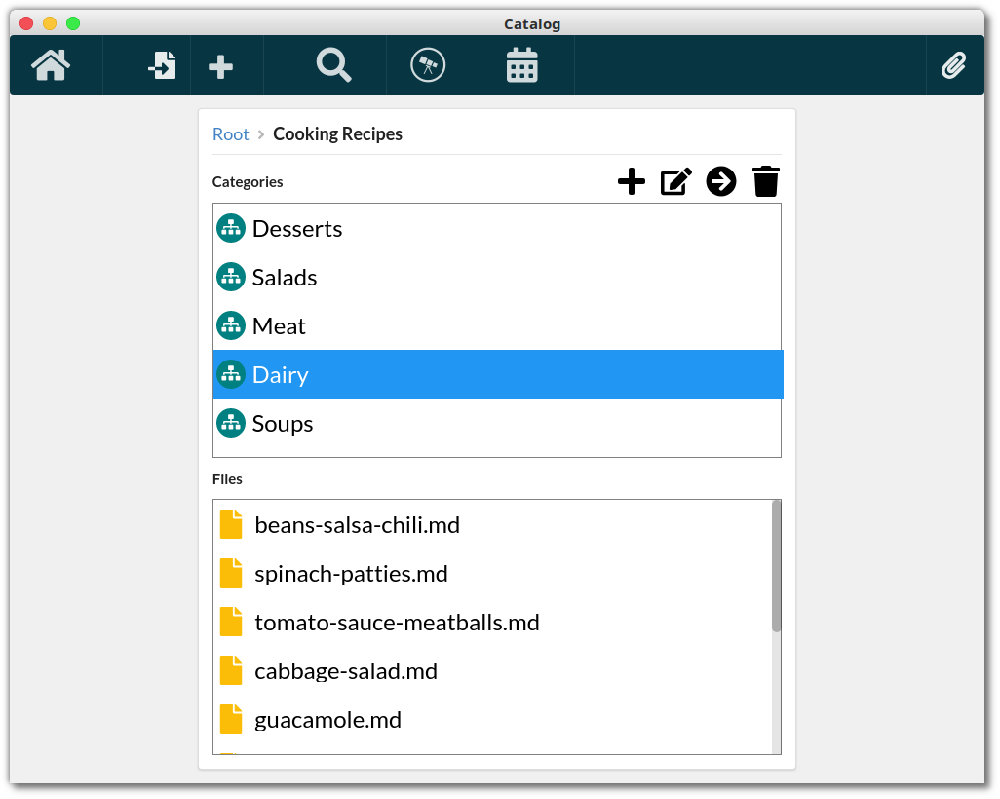

# Catalog - A Better Structure for Your Files

## About

Catalog is an open-source data manager and file navigator. It helps organize files on local drives
by adding categories to files. Users get the same user interface to manage their files on different
platforms. Catalog is compatible with Windows, Linux and Mac. The application requires neither
internet connection, nor user's registration to run on desktop devices.

<div align="center">
  
</div>

## Features

- Desktop application
- Web Clipper browser extension (installation instructions)

## Installation

### Mac OS X

1. Download the latest release for your platform: choose Asset
   [Catalog-X.Y.Z.dmg](https://github.com/amitnovick/catalog/releases)
2. Right-click on the app and select "Open" from the context menu.
3. An are-you-sure dialog will pop up, asking for permission to run the app.

### Windows

1. Download the latest release for your platform: choose Asset
   [catalog-setup-X.Y.Z.exe](https://github.com/amitnovick/catalog/releases)
2. Open the file and start the installation

### Linux

1. Download the latest release for your platform: choose Asset
   [catalog-X.Y.Z-x86_64.AppImage](https://github.com/amitnovick/catalog/releases)
2. Enable necessary permission for execution via `chmod a+x ./catalog-X.Y.Z-x86_64.AppImage`
3. Open with: `./catalog-X.Y.Z-x86_64.AppImage`

## Alternative: Installation from source

1. Clone the repository

2. Install dependencies

```bash
npm install
```

3. Create a packaged build for your platform

#### Mac OS X:

```bash
npm run pack:mac
```

#### Windows:

```bash
npm run pack:win
```

#### Linux

```bash
npm run pack:linux
```

Finally: Install a binary on `/dist` that should be named `Catalog...`

## Development

```bash
npm run develop
```

## Attribution

Logo uses modified version of the "Sitemap" SVG asset by Font Awesome, as made avilable for public
use by the [Creative Commons Attribution 4.0 license](https://creativecommons.org/licenses/by/4.0/)

## License

Copyright © 2019 [Amit Novick](https://amitnovick.netlify.com/). Distributed under the GNU AFFERO
PUBLIC LICENSE, Version 3. See separate LICENSE file.
